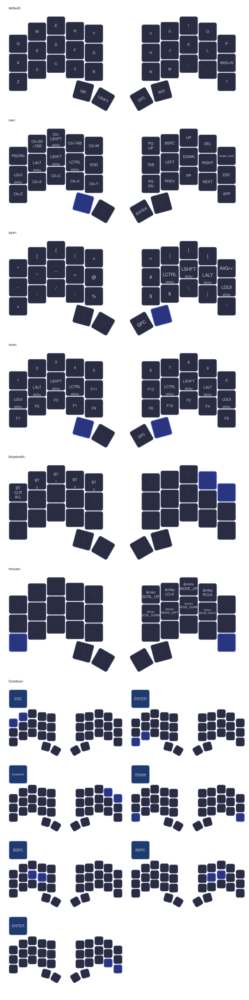

# Ferris Sweep ZMK Config

Personal ZMK keymap for the [Ferris Sweep](https://github.com/davidphilipbarr/Sweep) — a 34-key split keyboard running on nice!nano v2 boards. Build artifacts (UF2) are produced automatically by GitHub Actions.

## Keymap



## Layers

| Layer | Activation | Description |
|-------|-----------|-------------|
| **Default** | — | QWERTY base layer with space and shift on thumbs |
| **NAV** | Hold left thumb | Navigation (arrows, page up/down), clipboard shortcuts, media controls |
| **SYM** | Hold right thumb | Symbols and brackets |
| **NUM** | Hold both thumbs | Numbers and function keys |
| **Bluetooth** | O + P combo | Bluetooth profile selection and clearing |
| **Mouse** | Z + ? combo | Mouse movement and scroll |

## Combos

| Keys | Output |
|------|--------|
| `Q + W` | Escape |
| `Z + X` | Enter (left hand) |
| `. + ?` | Enter (right hand) |
| `D + F` | Backspace (left hand) |
| `J + K` | Backspace (right hand) |
| `O + P` | Bluetooth layer |
| `Z + ?` | Mouse layer |

## Updating the visualization

After editing the keymap, regenerate the image with:

```bash
keymap parse -c 34 -z config/cradio.keymap > keymap.yaml
keymap -c keymap-config.yaml draw keymap.yaml > visualization.svg
rsvg-convert -o visualization.png visualization.svg
```

Requires [`keymap-drawer`](https://github.com/caksoylar/keymap-drawer) (`pipx install keymap-drawer`) and `rsvg-convert` (`librsvg`).
